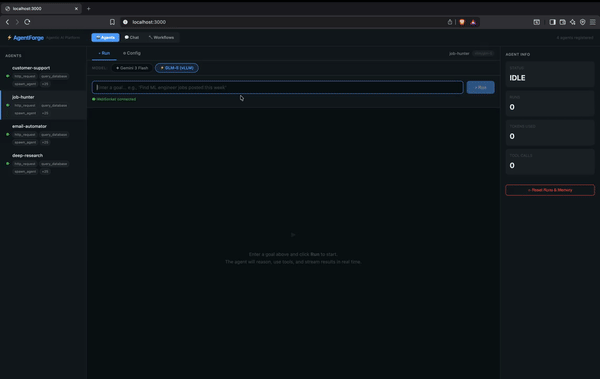

# ⚡ AgentForge

**A lightweight, self-hostable agentic AI platform.** Build autonomous agents with any LLM provider, wire them to tools, and test them through a built-in UI — no expensive SaaS required.



---

## Key Features

- **LLM Provider Agnostic** — OpenAI, Anthropic, Ollama, Qwen, custom vLLM endpoints. Switch providers in the UI without restarting.
- **Tool System** — Python functions decorated with `@tool`. Includes web_search, scrape_url, send_email, query_database, read_file, write_file, http_request. Tools are hot-loadable.
- **ReAct Planner** — Goal → LLM Reasoning → Tool Selection → Execute → Repeat. Each step streams to the UI in real time.
- **Two-Level Memory** — Short-term (SQLite conversation history) + Long-term (Chroma vector store for retrieval).
- **Built-in Testing UI** — Run/Chat/Config tabs per agent, WebSocket streaming, live stats, memory inspector.
- **Agent Templates** — Job Hunter, Deep Research, Email Automator, Customer Support — ready to use out of the box.

---

## Architecture

```
                        User
                          │
                    ┌─────▼──────┐
                    │  Next.js   │  ← Built-in Testing UI
                    │  Test UI   │     Run / Chat / Config
                    └─────┬──────┘
                          │ WebSocket + REST
                    ┌─────▼──────┐
                    │  FastAPI   │  ← API Gateway
                    │  Gateway   │
                    └─────┬──────┘
                          │
                    ┌─────▼──────────────┐
                    │   Agent Engine     │
                    │  ┌──────────────┐  │
                    │  │ Planner(LLM) │  │  ← ReAct loop
                    │  │ Tool Executor│  │
                    │  │ Memory Mgr   │  │
                    │  │ Task Ctrl    │  │
                    │  └──────────────┘  │
                    └─────┬──────────────┘
                          │
            ┌─────────────┼─────────────┐
            ▼             ▼             ▼
       Tool Registry   Memory        LLM Layer
       (scraper,       (SQLite       (OpenAI /
        email,          + Chroma)     Anthropic /
        HTTP, fs)                     Ollama / vLLM)
```

---

## Quick Start

### 1. Clone & Install

```bash
cd agent-platform
pip install -e ".[dev]"
cp .env.example .env
# Edit .env with your API keys
```

### 2. Start the Backend

```bash
cd agent-platform
uvicorn api.server:app --reload --port 8000
```

The server auto-discovers tools and loads agent templates from `agents/*.yaml`.

### 3. Start the UI

```bash
cd agent-platform/ui
npm install
npm run dev
```

Open [http://localhost:3000](http://localhost:3000) — you'll see all registered agents in the sidebar.

### 4. Test an Agent

1. Select an agent from the sidebar (e.g., **job-hunter**)
2. **Run Tab** — Type a goal like "Find ML engineer jobs posted this week" and click Run
3. Watch the ReAct loop stream in real time: Plan → Tool Call → Result → ... → Done
4. **Chat Tab** — Have a multi-turn conversation: "now filter only remote ones"
5. **Config Tab** — Switch model to `claude-3-sonnet` or point to your local Ollama

---

## API Reference

| Method   | Endpoint                    | Description                    |
|----------|-----------------------------|--------------------------------|
| `POST`   | `/agents`                   | Register a new agent           |
| `GET`    | `/agents`                   | List all agents + status       |
| `GET`    | `/agents/{id}`              | Get agent details              |
| `DELETE` | `/agents/{id}`              | Remove an agent                |
| `POST`   | `/agents/{id}/run`          | Run with a goal                |
| `GET`    | `/agents/{id}/status`       | Current run state + history    |
| `WS`     | `/agents/{id}/stream`       | Live execution log stream      |
| `POST`   | `/agents/{id}/chat`         | Send a chat message            |
| `GET`    | `/agents/{id}/memory`       | Inspect memory state           |
| `DELETE` | `/agents/{id}/memory`       | Clear memory                   |
| `PATCH`  | `/agents/{id}/config`       | Update LLM config at runtime   |
| `GET`    | `/health`                   | Health check                   |
| `GET`    | `/tools`                    | List discovered tools          |

### Example: Run an Agent

```bash
curl -X POST http://localhost:8000/agents/job_hunter/run \
  -H "Content-Type: application/json" \
  -d '{"goal": "Find ML engineer jobs posted this week"}'
```

### Example: Chat with an Agent

```bash
curl -X POST http://localhost:8000/agents/deep_research/chat \
  -H "Content-Type: application/json" \
  -d '{"message": "Research the latest developments in quantum computing"}'
```

---

## Streaming Events

Connect via WebSocket to `ws://localhost:8000/agents/{id}/stream` to receive real-time execution logs:

| Event Type    | Description                              |
|---------------|------------------------------------------|
| `plan`        | LLM's reasoning step                    |
| `tool_call`   | Which tool fired and with what args      |
| `tool_result` | What the tool returned                   |
| `memory_read` | What the agent retrieved from memory     |
| `done`        | Final output                             |
| `error`       | Failure with retry count                 |
| `retry`       | Tool retry attempt (⚠ Retry 1/3)        |
| `info`        | General information                      |

```json
{
  "type": "tool_call",
  "data": {"tool": "web_search", "args": {"query": "ML engineer jobs 2026"}},
  "agent_id": "job_hunter",
  "step": 2,
  "timestamp": 1741689600.0
}
```

---

## Creating Custom Tools

```python
from tools.registry import tool

@tool(
    name="my_custom_tool",
    description="Does something amazing",
    tags=["custom"],
)
async def my_custom_tool(param1: str, param2: int = 10) -> str:
    """Your tool logic here."""
    result = f"Processed {param1} with {param2}"
    return result
```

Drop the file in `tools/` — the hot-reload watcher will pick it up automatically.

---

## Creating Custom Agents

### Via YAML (recommended)

Create a file in `agents/my_agent.yaml`:

```yaml
id: "my_agent"
name: "My Custom Agent"
description: "A custom agent for my workflow"
tools:
  - web_search
  - scrape_url
  - write_file
llm:
  provider: "anthropic"
  model: "claude-3-sonnet-20240229"
  temperature: 0.5
max_steps: 20
goal_prompt: |
  You are a specialized agent for...
```

### Via API

```bash
curl -X POST http://localhost:8000/agents \
  -H "Content-Type: application/json" \
  -d '{
    "name": "My Agent",
    "description": "Does cool stuff",
    "tools": ["web_search", "write_file"],
    "llm": {"provider": "openai", "model": "gpt-4o"}
  }'
```

---

## Agent Templates

| Template            | Workflow                                               | Tools                                    |
|---------------------|--------------------------------------------------------|------------------------------------------|
| **Job Hunter**      | scrape_jobs → resume_match → summarize → notify        | web_search, scrape_url, write_file, email |
| **Deep Research**   | web_search → scrape → analyze → summarize → write      | web_search, scrape_url, write_file       |
| **Email Automator** | read_emails → categorize → draft_reply → queue         | read_file, write_file, send_email        |
| **Customer Support**| query_kb → draft_response → escalate_if_needed         | web_search, read_file, write_file, http  |

---

## Project Structure

```
agent-platform/
├── api/                    ← FastAPI backend
│   ├── server.py           ← Main app + lifespan
│   ├── routes/agents.py    ← REST endpoints
│   └── ws/stream.py        ← WebSocket streaming
├── core/                   ← Agent engine
│   ├── agent.py            ← Agent + AgentManager
│   ├── planner.py          ← ReAct loop
│   ├── executor.py         ← Tool execution + tracking
│   ├── memory.py           ← Short-term + Long-term memory
│   └── streaming.py        ← Event bus + log emitter
├── tools/                  ← Tool system
│   ├── registry.py         ← @tool decorator + auto-discovery
│   ├── web_search.py       ← Web search (SerpAPI / DDG)
│   ├── scraper.py          ← URL scraper
│   ├── email.py            ← SMTP email
│   ├── http_tools.py       ← HTTP requests + DB query
│   └── file_tools.py       ← Sandboxed file I/O
├── llm/                    ← LLM provider layer
│   ├── base.py             ← Abstract provider + factory
│   ├── openai_provider.py  ← OpenAI (GPT-4o, etc.)
│   ├── anthropic_provider.py ← Claude
│   ├── ollama_provider.py  ← Ollama (local models)
│   └── custom_endpoint.py  ← vLLM / TGI / custom
├── agents/                 ← Agent templates (YAML + Python)
│   ├── base_agent.py       ← Shared template base class
│   ├── job_agent.py        ← Job Hunter template
│   ├── research_agent.py   ← Deep Research template
│   ├── email_agent.py      ← Email Automator template
│   └── support_agent.py    ← Customer Support template
├── ui/                     ← Next.js Testing UI
│   ├── pages/index.tsx     ← Main workspace
│   ├── components/         ← AgentSidebar, RunTab, ChatTab, ConfigTab
│   └── hooks/              ← useAgentStream (WebSocket)
├── configs/agent.yaml      ← Default configuration
├── examples/               ← Working examples
├── pyproject.toml          ← Python project config
└── README.md
```

---

## Roadmap

- **v1** — Core Platform: Agent engine, ReAct planner, tool system, multi-provider LLM, SQLite memory, FastAPI
- **v1.5** — Testing UI: Built-in Next.js UI with Run/Chat/Config, WebSocket streaming, memory inspector
- **v2** — Workflow Builder: Visual drag-and-drop editor, YAML export, step-level debugging
- **v3** — Multi-Agent: Agents that spawn sub-agents, shared memory bus, agent-to-agent protocol
- **v4** — Marketplace: Community agent templates and tools, one-click install

---

## License

MIT
