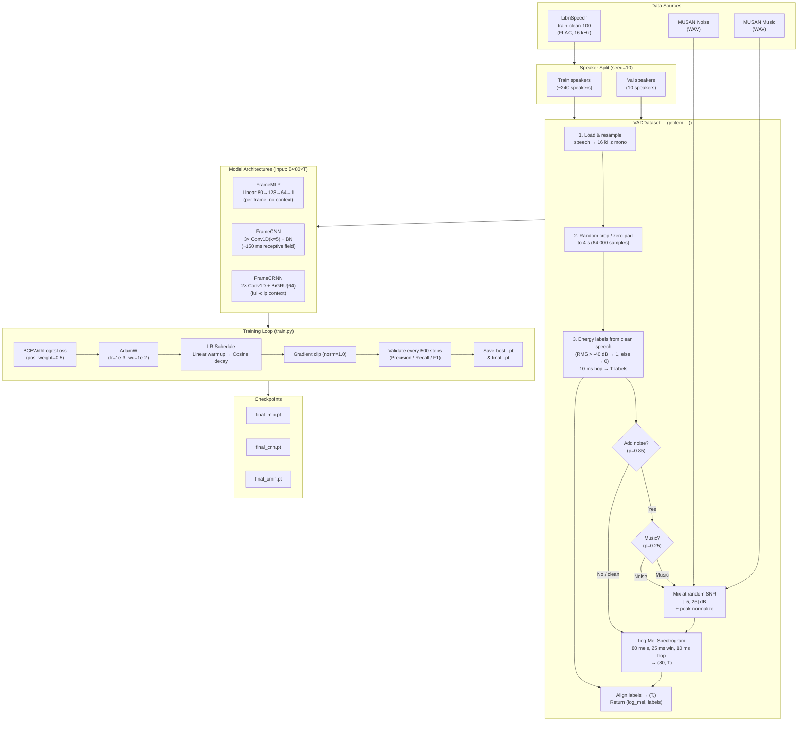
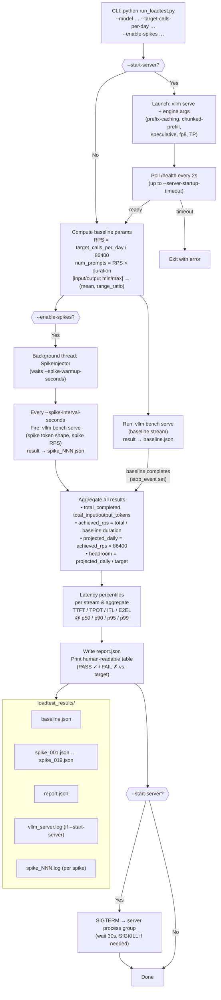

# VAD Training + vLLM Load Test Framework

This repository contains two independent but complementary systems:

1. **VAD Training Pipeline** — Train frame-level Voice Activity Detection (VAD) models on LibriSpeech + MUSAN using three neural architectures (MLP, CNN, CRNN).
2. **vLLM Load Test Framework** — A production-grade wrapper around `vllm bench serve` that stress-tests an LLM serving endpoint under realistic baseline + spike traffic, then emits a structured capacity report.

---

## Table of Contents

- [Repository Layout](#repository-layout)
- [Part 1 — VAD Training Pipeline](#part-1--vad-training-pipeline)
  - [Datasets](#datasets)
  - [Data Preparation](#data-preparation)
  - [Model Architectures](#model-architectures)
  - [Training](#training)
  - [Checkpoints](#checkpoints)
  - [Notebooks](#notebooks)
  - [Tests](#tests)
  - [VAD Flow Diagram](#vad-flow-diagram)
- [Part 2 — vLLM Load Test Framework](#part-2--vllm-load-test-framework)
  - [How It Works](#how-it-works)
  - [CLI Reference](#cli-reference)
  - [Output & Metrics](#output--metrics)
  - [Load Test Flow Diagram](#load-test-flow-diagram)
- [Quick-Start](#quick-start)
- [Results](#results)

---

## Repository Layout

```
.
├── run_loadtest.py              # vLLM load test framework (standalone script)
├── checkpoints/
│   ├── final_mlp.pt             # Saved MLP checkpoint
│   ├── final_cnn.pt             # Saved CNN checkpoint
│   └── final_crnn.pt            # Saved CRNN checkpoint
├── loadtest_results/
│   ├── baseline.json            # Raw vllm bench output for steady-state run
│   ├── spike_001.json … spike_019.json   # Raw output per spike burst
│   └── report.json              # Aggregated capacity report
├── tests/
│   └── test_prepare_dataset.py  # pytest unit tests for dataset utilities
└── vad_train/
    ├── prepare_dataset.py       # Dataset class + audio utilities
    ├── vad_models.py            # FrameMLP, FrameCNN, FrameCRNN architectures
    ├── train.py                 # Training script (CLI)
    ├── run_training.ipynb       # Interactive training notebook
    ├── test_dataset.ipynb       # Dataset inspection notebook
    ├── test_models.ipynb        # Model inference / sanity-check notebook
    ├── verify_data.ipynb        # Data verification notebook
    ├── LibriSpeech/
    │   └── train-clean-100/     # ~250 speaker directories (FLAC files)
    └── musan/
        ├── noise/               # Environmental noise clips
        ├── music/               # Music clips
        └── speech/              # Background speech clips
```

---

## Part 1 — VAD Training Pipeline

### Datasets

| Dataset | Role | Location |
|---|---|---|
| [LibriSpeech train-clean-100](https://www.openslr.org/12) | Speech source (positive class) | `vad_train/LibriSpeech/train-clean-100/` |
| [MUSAN noise](https://www.openslr.org/17) | Environmental noise (mixed at random SNR) | `vad_train/musan/noise/` |
| [MUSAN music](https://www.openslr.org/17) | Music (mixed at random SNR, 25% probability) | `vad_train/musan/music/` |

Speaker-based train/validation split is applied: 10 speakers are held out for validation; the rest train. This prevents speaker leakage.

### Data Preparation

**File:** `vad_train/prepare_dataset.py`

Each training sample is built on-the-fly inside `VADDataset.__getitem__`:

1. **Load speech** — randomly pick a LibriSpeech FLAC file, resample to 16 kHz mono.
2. **Crop/pad** — cut or zero-pad to a fixed `clip_seconds` (default 4 s) window.
3. **Generate labels** — derive frame-level speech/silence labels from the *clean* waveform using RMS energy thresholding (`-40 dB` relative). One label per 10 ms hop.
4. **Add noise** — with probability `prob_noise=0.85`, mix in a random MUSAN noise clip at a uniformly sampled SNR from `[-5, 25] dB`. With probability `prob_music=0.25`, music is used instead of environmental noise. Mixture is peak-normalised to `≤ 0.99`.
5. **Compute log-mel spectrogram** — 80-mel filterbank, 512-point FFT, 25 ms window, 10 ms hop → shape `(80, T)`. Applied to the *noisy* mixture.
6. **Align labels** — crop or edge-pad labels to match `T` frames.
7. **Return** `(log_mel: Tensor[80, T], labels: Tensor[T])`.

Key hyperparameters of `VADDataset`:

| Parameter | Default | Meaning |
|---|---|---|
| `clip_seconds` | 4.0 | Duration of each training clip |
| `sample_rate` | 16 000 Hz | Target sample rate |
| `n_mels` | 80 | Mel filterbank size |
| `hop_ms` | 10 ms | Frame hop (= label resolution) |
| `frame_ms` | 25 ms | Analysis window |
| `snr_range_db` | [-5, 25] dB | Noise mixing range |
| `prob_noise` | 0.85 | Probability of adding noise |
| `prob_music` | 0.25 | Probability of using music over noise |
| `prob_clean` | 0.15 | Probability of keeping clip clean |
| `label_threshold_db` | -40 dB | RMS threshold for speech label |
| `epoch_size` | 50 000 | Virtual dataset length per epoch |

### Model Architectures

**File:** `vad_train/vad_models.py`

All three models take `x: Tensor[B, 80, T]` as input and output `logits: Tensor[B, T]` (one logit per 10 ms frame). Binary cross-entropy with logits is the loss.

#### FrameMLP

The simplest baseline. Each frame is classified **independently** from its 80-dim mel vector. No temporal context.

```
Input  (B, 80, T)
  → reshape to (B·T, 80)
  → Linear(80 → 128) → ReLU → Dropout
  → Linear(128 → 64)  → ReLU → Dropout
  → Linear(64 → 1)
  → reshape to (B, T)
```

#### FrameCNN

1D convolutions over the time axis. Each output frame sees a receptive field of ~150 ms (3 layers × kernel-5 × 10 ms hop).

```
Input  (B, 80, T)
  → ConvBlock(80 → 64, k=5)   [Conv1d → BN → ReLU → Dropout]
  → ConvBlock(64 → 64, k=5)
  → ConvBlock(64 → 64, k=5)
  → Conv1d(64 → 1, k=1)
  → squeeze → (B, T)
```

#### FrameCRNN

CNN for local feature extraction followed by a bidirectional GRU for whole-clip temporal context.

```
Input  (B, 80, T)
  → ConvBlock(80 → 64, k=5)
  → ConvBlock(64 → 64, k=5)
  → transpose → (B, T, 64)
  → BiGRU(input=64, hidden=64) → (B, T, 128)
  → Linear(128 → 1)
  → squeeze → (B, T)
```

| Model | Temporal context | Parameters (approx.) |
|---|---|---|
| FrameMLP | None (per-frame) | ~22 K |
| FrameCNN | ~150 ms (local) | ~50 K |
| FrameCRNN | Full clip (global) | ~120 K |

### Training

**File:** `vad_train/train.py`

```bash
conda activate audio
cd vad_train
python train.py --model crnn --epochs 5 --batch-size 32 --epoch-size 50000
```

Full CLI options:

| Flag | Default | Description |
|---|---|---|
| `--model` | `crnn` | Architecture: `mlp`, `cnn`, `crnn` |
| `--speech-dir` | `…/LibriSpeech/train-clean-100` | Path to speech data |
| `--noise-dir` | `…/musan/noise` | Path to MUSAN noise |
| `--music-dir` | `…/musan/music` | Path to MUSAN music |
| `--out-dir` | `…/checkpoints` | Checkpoint output directory |
| `--epochs` | 3 | Number of epochs |
| `--epoch-size` | 5 000 | Samples per epoch (set ≥ 50 000 for serious runs) |
| `--batch-size` | 32 | Batch size |
| `--num-workers` | 8 | DataLoader worker count |
| `--lr` | 1e-3 | Peak learning rate |
| `--warmup-steps` | 500 | Linear warmup steps |
| `--weight-decay` | 1e-2 | AdamW weight decay |
| `--pos-weight` | 0.5 | BCE positive-class weight (↑ for higher recall) |
| `--val-every` | 500 | Validation frequency (steps) |
| `--log-every` | 50 | Logging frequency (steps) |
| `--clip-grad` | 1.0 | Gradient norm clip |
| `--seed` | 42 | Global RNG seed |

**Optimiser:** AdamW with cosine decay LR schedule (linear warmup → cosine annealing to `1e-6`).

**Validation:** Up to 50 batches of held-out speakers evaluated every `--val-every` steps. Best F1 checkpoint saved as `best_<model>.pt`; final checkpoint saved as `final_<model>.pt`.

**Metrics reported:** Precision, Recall, F1 (at threshold 0.5).

### Checkpoints

Pre-trained checkpoints in `checkpoints/`:

| File | Architecture |
|---|---|
| `final_mlp.pt` | FrameMLP |
| `final_cnn.pt` | FrameCNN |
| `final_crnn.pt` | FrameCRNN |

Each `.pt` file is a `torch.save` dict containing `model_state`, `model_name`, `step`, `f1`, and `args`.

### Notebooks

| Notebook | Purpose |
|---|---|
| `run_training.ipynb` | Interactive training with live loss/metric curves |
| `test_dataset.ipynb` | Inspect dataset samples: waveform, mel, labels overlay |
| `test_models.ipynb` | Load checkpoints, run inference, visualise frame-level predictions |
| `verify_data.ipynb` | Data integrity checks (file counts, duration stats, SNR distribution) |

### Tests

```bash
conda activate audio
pytest tests/test_prepare_dataset.py -v
```

Covers: `find_audio_files`, `load_audio_mono`, `fit_length`, `mix_at_snr`, `speech_labels_from_energy` — happy paths, edge cases, and regression cases.

### VAD Flow Diagram



---

## Part 2 — vLLM Load Test Framework

**File:** `run_loadtest.py`

### How It Works

The script is a thin but production-grade wrapper around `vllm bench serve`. It orchestrates:

1. **(Optional) Server launch** — starts `vllm serve <model>` with throughput-oriented engine args (prefix caching, chunked prefill, speculative decoding, fp8 quantisation, tensor parallelism) and polls `/health` until ready.
2. **Baseline benchmark** — runs `vllm bench serve` at a configurable RPS (derived from `--target-calls-per-day` or set explicitly) with p50-representative input/output token shapes. Results saved to `baseline.json`.
3. **Spike injection** — a background thread fires additional `vllm bench serve` subprocesses concurrently with the baseline at configurable intervals, simulating p90/p99 traffic bursts. Each spike burst is saved to `spike_NNN.json`.
4. **Aggregation** — after the baseline completes, all raw JSON results are merged. The script computes RPS, TPM, projected daily capacity, headroom vs. target, and full latency percentiles (p50/p90/p95/p99) for TTFT, TPOT, ITL, and E2EL.
5. **Report** — a human-readable table is printed and `report.json` is written to `--results-dir`.
6. **(Optional) Server teardown** — sends `SIGTERM` to the server process group.

#### Token range → `vllm bench` conversion

`vllm bench serve` takes `--random-input-len` (mean) and `--random-range-ratio`. This script converts `[min, max]` token ranges via:

$$\text{mean} = \frac{\text{min} + \text{max}}{2}, \quad \text{ratio} = \frac{\text{max} - \text{min}}{\text{max} + \text{min}}$$

so that the bench tool samples uniformly from the originally specified `[min, max]` window.

### CLI Reference

```
python run_loadtest.py --help
```

| Group | Flag | Default | Description |
|---|---|---|---|
| **Workload** | `--model` | *(required)* | HF model ID or local path |
| | `--base-url` | `http://127.0.0.1:8000` | OpenAI-compatible server URL |
| | `--endpoint` | `/v1/completions` | API endpoint path |
| | `--backend` | `vllm` | vllm bench backend |
| | `--target-calls-per-day` | 3 000 000 | Daily call target (derives RPS) |
| | `--duration-seconds` | 300 | Baseline test duration |
| | `--request-rate` | `auto` | Req/s (`auto` = target/86400, `inf` = max) |
| | `--max-concurrency` | None | Cap on in-flight baseline requests |
| | `--burstiness` | 1.0 | Arrival-time burstiness (1.0 = Poisson) |
| **Baseline tokens** | `--input-min/max` | 1024 / 2048 | Baseline input token range |
| | `--output-min/max` | 256 / 512 | Baseline output token range |
| **Spikes** | `--enable-spikes` | off | Inject high-token bursts |
| | `--spike-interval-seconds` | 60 | Seconds between spike starts |
| | `--spike-duration-seconds` | 10 | Length of each spike burst |
| | `--spike-input-min/max` | 10 000 / 20 000 | Spike input token range |
| | `--spike-output-min/max` | 1 024 / 2 048 | Spike output token range |
| | `--spike-request-rate` | 5.0 | Req/s during a spike |
| | `--spike-max-concurrency` | None | Concurrency cap per spike |
| | `--spike-warmup-seconds` | = interval | Delay before first spike |
| **Server** | `--start-server` | off | Launch vLLM server before test |
| | `--server-host/port` | 127.0.0.1 / 8000 | Bind address |
| | `--server-startup-timeout` | 600 s | Time to wait for `/health` |
| **Engine args** | `--enable-prefix-caching` | off | KV-cache prefix sharing |
| | `--enable-chunked-prefill` | on | Chunked prefill (throughput) |
| | `--speculative-config` | None | JSON for n-gram / draft speculative decoding |
| | `--max-num-seqs` | 256 | Max in-flight sequences |
| | `--max-num-batched-tokens` | 8192 | Max tokens per batch |
| | `--gpu-memory-utilization` | 0.90 | KV-cache memory fraction |
| | `--max-model-len` | None | Context window override |
| | `--tensor-parallel-size` | 1 | GPU count |
| | `--dtype` | `auto` | Model dtype |
| | `--kv-cache-dtype` | `fp8` | KV-cache dtype |
| | `--quantization` | `fp8` | Weight quantisation |
| | `--extra-engine-args` | `--limit-mm-per-prompt …` | Raw extra args to `vllm serve` |
| **Output** | `--results-dir` | `./loadtest_results` | Directory for all output files |
| | `--report-file` | `<results-dir>/report.json` | Override report path |

### Output & Metrics

**Per-run JSON** (`baseline.json`, `spike_NNN.json`) — raw vllm bench output including per-request latency distributions.

**Aggregate report** (`report.json` + stdout table):

| Metric | Description |
|---|---|
| `achieved_rps` | Requests completed per second across all streams |
| `tpm` | Tokens per minute (input + output) |
| `projected_daily_calls` | `achieved_rps × 86 400` |
| `capacity_headroom_x` | `projected_daily / target` — headroom multiplier |
| `can_handle_target` | `true` if headroom ≥ 1.0 |
| **TTFT** | Time to first token (mean / p50 / p90 / p95 / p99) |
| **TPOT** | Time per output token (mean / p50 / p90 / p95 / p99) |
| **ITL** | Inter-token latency (mean / p99) |
| **E2EL** | End-to-end latency (mean / p50 / p90 / p95 / p99) |

Per-spike summaries also include `mean_input_tokens`, `mean_output_tokens`, and the same latency breakdown.

### Load Test Flow Diagram



---

## Quick-Start

### Environment

```bash
conda activate audio   # Python environment with PyTorch + torchaudio + soundfile
```

### Train a VAD model

```bash
cd vad_train

# Quick smoke test (5 000 samples × 3 epochs)
python train.py --model crnn --epochs 3 --epoch-size 5000 --batch-size 32

# Full training run
python train.py --model crnn --epochs 10 --epoch-size 50000 --batch-size 64 \
    --lr 1e-3 --warmup-steps 500 --pos-weight 0.7
```

### Run the load test (against an existing server)

```bash
# Baseline only — 5-minute run at 3 M calls/day target
python run_loadtest.py \
    --model google/gemma-4-E4B \
    --base-url http://127.0.0.1:8000 \
    --target-calls-per-day 3000000 \
    --duration-seconds 300 \
    --input-min 1024 --input-max 2048 \
    --output-min 256  --output-max 512

# With spikes — every 60 s fire a 10 s burst of 10 k–20 k input tokens
python run_loadtest.py \
    --model google/gemma-4-E4B \
    --base-url http://127.0.0.1:8000 \
    --target-calls-per-day 3000000 \
    --duration-seconds 600 \
    --input-min 1024  --input-max 2048 \
    --output-min 256  --output-max 512 \
    --enable-spikes \
    --spike-interval-seconds 60 \
    --spike-duration-seconds 10 \
    --spike-input-min 10000 --spike-input-max 20000 \
    --spike-output-min 1024 --spike-output-max 2048 \
    --spike-request-rate 5
```

### Launch the server automatically

```bash
python run_loadtest.py \
    --model google/gemma-4-E4B \
    --target-calls-per-day 3000000 \
    --duration-seconds 300 \
    --input-min 1024 --input-max 2048 \
    --output-min 256  --output-max 512 \
    --start-server \
    --gpu-memory-utilization 0.9 \
    --max-num-seqs 256 \
    --enable-prefix-caching \
    --enable-chunked-prefill \
    --speculative-config '{"method":"ngram","num_speculative_tokens":5,"prompt_lookup_max":4}'
```

### Run tests

```bash
pytest tests/test_prepare_dataset.py -v
```

---

## Results

Sample results from `loadtest_results/report.json` (model: `google/gemma-4-E4B`, target: 1 M calls/day):

| Metric | Value |
|---|---|
| Duration | 3 609.7 s |
| Total requests | 42 610 |
| Achieved RPS | **11.80 req/s** |
| Target RPS | 11.57 req/s |
| Projected calls/day | **1 019 893** |
| Capacity headroom | **1.02×** |
| Can handle target? | **PASS ✓** |

**Baseline latency (ms):**

| Metric | Mean | p50 | p90 | p95 | p99 |
|---|---|---|---|---|---|
| TTFT | 903 | 204 | 2725 | 3087 | 3544 |
| TPOT | 47 | 50 | 57 | 59 | 63 |
| E2EL | 19 009 | 18 650 | 26 212 | 27 864 | 30 216 |
| ITL (mean/p99) | 47 | — | — | — | 165 |

19 spike bursts were injected; per-spike TTFT p99 ranged from ~650 ms to ~1 450 ms, demonstrating the system remained responsive under concurrent high-token bursts.
